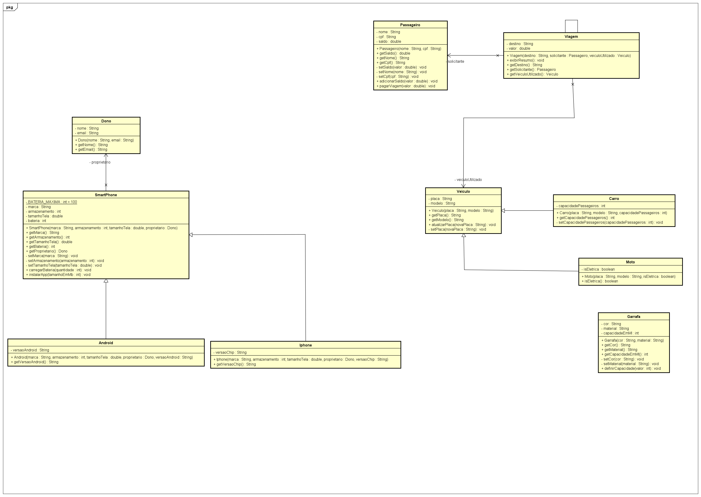

# FiapRide — POO FIAP

Projeto desenvolvido nas aulas de Programação Orientada a Objetos da FIAP.
Simula uma plataforma de mobilidade urbana aplicando os fundamentos de
Classes, Objetos, Encapsulamento, Construtores, Associação, Herança e **Polimorfismo** em Java.

---

## 🗂️ Diagrama de Classes (UML)



> Diagrama gerado no Astah. Mostra as relações de Herança (`extends`) e Associação (`Tem-Um`) entre todas as classes do projeto.

---

## 📁 Estrutura do Projeto

```
FiapRide
└── src
    ├── br.com.fiapride.main
    │   ├── SistemaPrincipal.java   ← testes do FiapRide
    │   └── TesteSmartPhone.java    ← testes do objeto pessoal
    └── br.com.fiapride.model
        ├── Passageiro.java         ← usuário da plataforma
        ├── Veiculo.java            ← superclasse de veículos
        ├── Carro.java              ← subclasse de Veiculo (herança)
        ├── Moto.java               ← subclasse de Veiculo (herança)
        ├── Viagem.java             ← associa Passageiro e Veiculo
        ├── SmartPhone.java         ← superclasse do objeto pessoal
        ├── Android.java            ← subclasse de SmartPhone (herança + polimorfismo)
        ├── Iphone.java             ← subclasse de SmartPhone (herança + polimorfismo)
        ├── Dono.java               ← associado ao SmartPhone
        └── Garrafa.java            ← objeto do microdesafio
```

---

## 🧩 Classes

### Passageiro
Representa um usuário cadastrado na plataforma FiapRide.
Não pode nascer sem nome e CPF.

| Atributo | Tipo   | Descrição                   |
|----------|--------|-----------------------------|
| nome     | String | Nome completo do passageiro |
| cpf      | String | CPF do passageiro           |
| saldo    | double | Saldo disponível em reais   |

| Método                   | Descrição                                   |
|--------------------------|---------------------------------------------|
| `Passageiro(nome, cpf)`  | Construtor — nome e CPF obrigatórios        |
| `adicionarSaldo(double)` | Adiciona saldo — bloqueia valores negativos |
| `pagarViagem(double)`    | Debita viagem — bloqueia saldo insuficiente |
| `getNome()`              | Retorna o nome                              |
| `getCpf()`               | Retorna o CPF                               |
| `getSaldo()`             | Retorna o saldo                             |

---

### Veiculo ← superclasse
Representa um veículo cadastrado no FiapRide.
Nenhum veículo pode rodar sem placa e modelo.

| Atributo | Tipo   | Descrição         |
|----------|--------|-------------------|
| placa    | String | Placa do veículo  |
| modelo   | String | Modelo do veículo |

| Método                   | Descrição                                      |
|--------------------------|------------------------------------------------|
| `Veiculo(placa, modelo)` | Construtor — placa e modelo obrigatórios       |
| `atualizarPlaca(String)` | Atualiza placa — bloqueia valores nulos/vazios |
| `getPlaca()`             | Retorna a placa                                |
| `getModelo()`            | Retorna o modelo                               |

> Não existe `setModelo()` — o modelo de um veículo é imutável na vida real.

---

### Carro `extends Veiculo`
Especialização de `Veiculo`. Herda placa e modelo, adiciona capacidade de passageiros.
Teste do "É UM": Carro **é um** Veículo ✔

| Atributo              | Tipo | Descrição                        |
|-----------------------|------|----------------------------------|
| capacidadePassageiros | int  | Quantidade máxima de passageiros |

| Método                                        | Descrição                               |
|-----------------------------------------------|-----------------------------------------|
| `Carro(placa, modelo, capacidadePassageiros)` | Construtor — usa `super(placa, modelo)` |
| `getCapacidadePassageiros()`                  | Retorna a capacidade de passageiros     |

---

### Moto `extends Veiculo`
Especialização de `Veiculo`. Herda placa e modelo, adiciona flag de elétrica.
Teste do "É UM": Moto **é um** Veículo ✔

| Atributo   | Tipo    | Descrição                   |
|------------|---------|-----------------------------|
| isEletrica | boolean | Indica se a moto é elétrica |

| Método                            | Descrição                               |
|-----------------------------------|-----------------------------------------|
| `Moto(placa, modelo, isEletrica)` | Construtor — usa `super(placa, modelo)` |
| `isEletrica()`                    | Retorna se a moto é elétrica            |

---

### Viagem
Conecta um `Passageiro` a um `Veiculo` através de associação (relação "Tem-Um").
Não pode existir sem destino, passageiro e veículo.

| Atributo         | Tipo       | Papel na Viagem                  |
|------------------|------------|----------------------------------|
| destino          | String     | Endereço de destino              |
| valor            | double     | Valor da corrida (inicia zerado) |
| solicitante      | Passageiro | Quem pediu a viagem              |
| veiculoUtilizado | Veiculo    | Qual veículo vai atender         |

| Método                                   | Descrição                                         |
|------------------------------------------|---------------------------------------------------|
| `Viagem(destino, solicitante, veiculo)`  | Construtor — os três parâmetros são obrigatórios  |
| `exibirResumo()`                         | Imprime destino, passageiro e veículo             |
| `getDestino()`                           | Retorna o destino                                 |
| `getSolicitante()`                       | Retorna o objeto `Passageiro`                     |
| `getVeiculoUtilizado()`                  | Retorna o objeto `Veiculo`                        |

> `Viagem` aceita qualquer subtipo de `Veiculo` — um `Carro` ou uma `Moto` podem ser passados
> sem alteração, pois ambos **são** `Veiculo` (polimorfismo).

---

### Dono
Representa o proprietário de um `SmartPhone` (associação "Tem-Um").

| Atributo | Tipo   | Descrição            |
|----------|--------|----------------------|
| nome     | String | Nome do proprietário |
| email    | String | E-mail do dono       |

| Método              | Descrição                       |
|---------------------|---------------------------------|
| `Dono(nome, email)` | Construtor — ambos obrigatórios |
| `getNome()`         | Retorna o nome                  |
| `getEmail()`        | Retorna o e-mail                |

---

### SmartPhone ← superclasse
Objeto pessoal encapsulado. Não pode existir sem um `Dono` definido.

| Atributo      | Tipo   | Descrição                     |
|---------------|--------|-------------------------------|
| marca         | String | Fabricante do aparelho        |
| armazenamento | int    | Espaço disponível em MB       |
| tamanhoTela   | double | Tamanho da tela em polegadas  |
| bateria       | int    | Nível da bateria de 0 a 100   |
| valor         | double | Valor do aparelho em reais    |
| proprietario  | Dono   | Dono do aparelho (associação) |

| Método                                       | Descrição                                        |
|----------------------------------------------|--------------------------------------------------|
| `SmartPhone(marca, arm, tela, proprietario)` | Construtor — todos os parâmetros obrigatórios    |
| `calcularTaxaSeguro()`                       | **Polimórfico** — retorna 10% do valor (genérico)|
| `carregarBateria(int)`                       | Carrega bateria — bloqueia negativo, limita 100% |
| `instalarApp(int)`                           | Instala app — bloqueia se sem espaço             |
| `getMarca()`                                 | Retorna a marca                                  |
| `getArmazenamento()`                         | Retorna o armazenamento                          |
| `getTamanhoTela()`                           | Retorna o tamanho da tela                        |
| `getBateria()`                               | Retorna o nível da bateria                       |
| `getProprietario()`                          | Retorna o objeto `Dono`                          |

---

### Android `extends SmartPhone`
Especialização de `SmartPhone`. Herda todos os atributos e comportamentos, adiciona versão do SO.
Teste do "É UM": Android **é um** SmartPhone ✔

| Atributo      | Tipo   | Descrição                 |
|---------------|--------|---------------------------|
| versaoAndroid | String | Versão do sistema Android |

| Método                                                   | Descrição                                              |
|----------------------------------------------------------|--------------------------------------------------------|
| `Android(marca, arm, tela, proprietario, versaoAndroid)` | Construtor — usa `super(...)`                          |
| `calcularTaxaSeguro()`                                   | `@Override` — retorna **15%** do valor (ecossistema aberto) |
| `getVersaoAndroid()`                                     | Retorna a versão do Android                            |

---

### Iphone `extends SmartPhone`
Especialização de `SmartPhone`. Herda todos os atributos e comportamentos, adiciona versão do chip.
Teste do "É UM": Iphone **é um** SmartPhone ✔

| Atributo   | Tipo   | Descrição                     |
|------------|--------|-------------------------------|
| versaoChip | String | Geração do chip Apple Silicon |

| Método                                                  | Descrição                                                |
|---------------------------------------------------------|----------------------------------------------------------|
| `Iphone(marca, arm, tela, proprietario, versaoChip)`   | Construtor — usa `super(...)`                            |
| `calcularTaxaSeguro()`                                  | `@Override` — retorna **20%** do valor (produto premium) |
| `getVersaoChip()`                                       | Retorna a versão do chip                                 |

---

### Garrafa
Objeto criado no microdesafio — encapsulamento e construtor.

| Atributo       | Tipo   | Descrição                   |
|----------------|--------|-----------------------------|
| cor            | String | Cor da garrafa              |
| material       | String | Material de fabricação      |
| capacidadeEmMl | int    | Capacidade entre 1 e 3000ml |

| Método                   | Descrição                                        |
|--------------------------|--------------------------------------------------|
| `Garrafa(cor, material)` | Construtor — cor e material obrigatórios         |
| `definirCapacidade(int)` | Define capacidade — bloqueia fora de 1 a 3000ml  |
| `getCor()`               | Retorna a cor                                    |
| `getMaterial()`          | Retorna o material                               |
| `getCapacidadeEmMl()`    | Retorna a capacidade                             |

---

## ▶️ Como executar

1. Clone o repositório:
```bash
git clone https://github.com/seu-usuario/fiap-poo.git
```

2. Abra o projeto no **IntelliJ IDEA**

3. Execute o arquivo desejado:
   - `SistemaPrincipal.java` → testa Passageiro, Carro, Moto e Viagem
   - `TesteSmartPhone.java` → testa Android, Iphone, Dono e **Polimorfismo**

---

## 🖥️ Saída esperada

### SistemaPrincipal
```
--- FIAPRIDE: Teste de Frota ---

Saldo adicionado! Novo saldo: R$ 50.0
Saldo adicionado! Novo saldo: R$ 12.5
Sucesso: placa agora é ABC-1234
Registro: Um Chevrolet Onix nasceu com a placa ABC-1234
Sucesso: placa agora é ABC-9999
Registro: Um Caloi City nasceu com a placa ABC-9999

--- Teste de Herança ---
Carro modelo: Chevrolet Onix | Placa: ABC-1234
Vagas para passageiros: 4

Moto modelo: Caloi City | Placa: ABC-9999
Atenção: Esta moto é elétrica!

--- Criando Viagens ---
Nova viagem solicitada para: Avenida Paulista, 1000
Nova viagem solicitada para: Rua Augusta, 500

--- RESUMO DA VIAGEM ---
Destino: Avenida Paulista, 1000
Passageiro: Ana Silva
Veículo: Chevrolet Onix (Placa: ABC-1234)
------------------------

--- RESUMO DA VIAGEM ---
Destino: Rua Augusta, 500
Passageiro: Carlos Souza
Veículo: Caloi City (Placa: ABC-9999)
------------------------

--- Prova da Passagem por Referência ---
Saldo adicionado! Novo saldo: R$ 150.0
Saldo da Ana consultado ATRAVÉS da Viagem: R$ 150.0
```

### TesteSmartPhone — Polimorfismo
```
══════════════════════════════════════════════
   TESTE DE POLIMORFISMO — calcularTaxaSeguro
══════════════════════════════════════════════

Dono registrado: João
Dono registrado: Lucia
Dono registrado: Carlos

--- Simulação de Cotação de Seguros ---

Aparelho : Samsung Galaxy S24 (Android)
Dono     : João
Valor    : R$ 4500,00
Taxa     : R$ 675,00          ← 15% — ecossistema aberto
----------------------------------------------
Aparelho : Apple iPhone 16 Pro (Iphone)
Dono     : Lucia
Valor    : R$ 9000,00
Taxa     : R$ 1800,00         ← 20% — produto premium
----------------------------------------------
Aparelho : Motorola Edge (SmartPhone)
Dono     : Carlos
Valor    : R$ 2000,00
Taxa     : R$ 200,00          ← 10% — regra genérica
----------------------------------------------

Observe: o MESMO comando 'calcularTaxaSeguro()'
gerou resultados DIFERENTES para cada objeto. Isso é Polimorfismo!
```

---

## 📚 Conceitos aplicados por aula

| Aula | Conceito            | O que foi feito                                                                          |
|------|---------------------|------------------------------------------------------------------------------------------|
| 01   | Abstração           | Modelagem das primeiras classes no Astah                                                 |
| 02   | Classes e Objetos   | Criação de `Passageiro`, `Veiculo` e `SmartPhone`                                        |
| 03   | Encapsulamento      | Atributos `private` com getters e setters validados                                      |
| 04   | Construtores        | Objetos nascem com estado válido e dados obrigatórios                                    |
| 05   | Associação (Tem-Um) | `Viagem` conecta `Passageiro` + `Veiculo`; `SmartPhone` recebe `Dono`                    |
| 06   | Herança (É-Um)      | `Carro` e `Moto` estendem `Veiculo`; `Android` e `Iphone` estendem `SmartPhone`         |
| 07   | Polimorfismo        | `calcularTaxaSeguro()` com `@Override` em `Android` (15%) e `Iphone` (20%) via `List<SmartPhone>` |

---

## 👨‍💻 Autor
**João Victor A. de Abreu** — FIAP Ciência da Computação